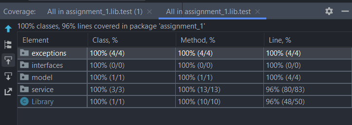

# CS305 Assignment 5
Submitter name: Aneeket Mangal\
Roll No.: 2019CSB1071\
Course:  CS305 Software Engineering\
===========================================
## 1. What does this program do
This program is a Java based library that reads SQL queries from an XML file and executes them on an RDBMS.
This library provides an API of following signature:
   ```
   Library(Connection connectionObject, String XMLFilePath)
   ```
The API implements following endpoints:
```bash
>  <T, R> R selectOne(String queryId, T queryParam, Class<R> resultType);
```

```bash
>  <T, R> List<R> selectMany(String queryId, T queryParam, Class<R> resultType);
```
```bash
>  <T> int insert(String queryId, T queryParam);
```
```bash
>  <T> int update(String queryId, T queryParam);
```
```bash
>  <T> int delete(String queryId, T queryParam);
```
The parameters of the query contains placeholders of the form ${placeholder_name} and they are populated
at the runtime with the provided object in the method call.
* In case of update, insert, and delete queries the API returns the number of rows affected.
* In case of selectOne, query API returns the POJO, whose class is provided in the call.
* In case of selectMany, query API returns an ArrayList of POJO.
* The parameters for the SQL queries will be dynamically populated at runtime from the supplied objects.
* Populating plain-old-java-objects (POJOs) from the results of SELECT queries.

## 2. A description of how this program works
Terminology associated with the project
* ```queryParam``` : Object sent in the API call, which is used to populate placeholders.
* ```id```/```queryId```: id of a query as in the XML file.
* ```paramType```: name of the object as mentioned in the paramType attribute of the sql query in XML file.
* ```componentType```: Following are considered as the component types.
  * String
  * Primitives (int, short, byte, long, float, double, boolean, and char) and there respective *Wrapper* classes.
  * Arrays of String/Primitives
  * Collection of String/Primitives
* ```QueryObject```: A object that contains description of the query fetched from the XML file.


Custom Runtime exceptions are defined for the program
* ```ParamTypeDifferentException```: Thrown when ```paramType``` and FQN of ```queryParam``` are not same.
* ```MultipleResultsFoundException```: Thrown when multiple records are fetched in a ```selectOne()``` API call.
* ```QueryNotFoundException```: Thrown when query with the given id cannot be found in the XML file.
* ```NotAComponentType```: Thrown when the ```queryParam``` is not a ```componentType```.


Following is the flow and description of classes

* First a query with given ```queryId``` is fetched from the XML file whose file path is provided in the constructor of the library.
* This utility is provided by the XMLParser class.


> * ```XMLParser```
>  * It makes use of the ```DOMParser``` API of ```Java```.
>  * It defines only one function ```getQueryObject```
>  * Methodically, first we fetch a ```Nodelist``` Object of all "sql" tags in the file. 
>  * It looks for the **first** tag that has a ```id``` attribute equal to the required queryId.
>  * The function returns an Object of type ```QueryObject```.

* The fetched query is now populated using the utility of StringUtility Class as mentioned below

> * ```StringUtility```
>  * After fetching the query using XMLParser, it is populated with fields values of queryParam object.
>  * This class provides utility of parsing the fetched queries and populating them.
>  * The ```populateQuery()``` method is called by the ```Library``` class during execution.

* Finally, the populated query is run using JDBC driver.
* Detailed explanation is provided as follows.

> * ```Library```: 
>  * This class implements the ```SQLRunner``` interface which contains abstract definition of API endpoints as listed above.
>  * This class has a single construction which requires a JDBC ```Connection``` object and filePath of the XML which consists of the SQL queries.
>  * This class implements the endpoints of the API. 
>  * It contains various helper functions to help process the SQL query and run it against a RDBMS. 
  
* Following types are supported for the ```queryParam```:
  * null object (user needs to provide "null" as ```paramType``` in XML).
  * Strings
  * Primitives (int, short, byte, long, float, double, boolean, and char) and there respective *Wrapper* classes.
  * Arrays of String/Primitives
  * Collection of String/Primitives
  * Array/Collection of custom objects (User needs to override the toString methods of those objects).
  * Date (override required).
  * Object whose fields are ```componentType```.
  * Object of custom objects (override required).


## 3. How to compile and run this program
### Prerequisites:
* This library is built using Java and Gradle.
* Testing of the library is done against [Sakila Database](https://dev.mysql.com/doc/sakila/en/sakila-installation.html).
* A sample XML file is present at given [location](lib/src/test/resources/queries.xml).
> **NOTE**\
> To run the tests, you need to configure [test.properties](lib/src/test/resources/test.properties).
> Format of the properties file should be as follows:
> ```
> user=${username}
> password=${password}
> ```
> Replace placeholders with username and password for your MYSQL server.


### Instructions to run:
* Clone the GitHub repo: 
```bash
    git clone https://github.com/aneeketMangal/cs305_2022.git
```
* To create a JAR file (The JAR file will be located in ```lib/build/libs/lib.jar```):
```bash
  ./gradlew build
```
* To run the unit tests:
```bash
  ./gradlew test
```


## 4. Provide a snapshot of a sample run



